# CloseAI / codigo-llm-api

Servico local para geracao de codigo Python com fine-tune remoto, conversao para GGUF e API HTTP para inferencia local.

Este projeto foi montado para resolver um problema bem pratico: treinar um modelo pequeno para responder melhor a prompts de codigo Python, empacotar esse modelo em um formato leve o bastante para CPU e expor isso por uma API simples, local e reutilizavel.

Hoje o fluxo recomendado do sistema e:

1. treino remoto via Kaggle API;
2. download automatico do modelo fundido;
3. conversao local para GGUF;
4. inferencia local via `llama-server`;
5. exposicao HTTP via FastAPI.

O projeto inclui:

- fluxo principal para Windows;
- fluxo equivalente para Ubuntu sem Docker;
- runtime opcional com Docker no Ubuntu;
- stack pronta para Portainer com Traefik e auto-bootstrap do modelo;
- ferramentas auxiliares para dataset, VS Code, validacao e smoke test.

## 0. Instalacao passo a passo via clone do GitHub

Se voce quer sair do zero e colocar o projeto para rodar a partir do repositorio publicado, siga esta secao primeiro.

### 0.1 Clonar o projeto

No Windows:

```powershell
git clone https://github.com/bugzoidTM/CloseAI.git
cd CloseAI
```

No Ubuntu:

```bash
git clone https://github.com/bugzoidTM/CloseAI.git
cd CloseAI
```

### 0.2 Entenda os dois caminhos possiveis

Depois do clone, voce pode seguir um destes fluxos:

1. `Ja tenho um modelo GGUF pronto`
   - voce copia `modelo_python.gguf` para a raiz do projeto;
   - nao precisa rodar treino remoto;
   - nao precisa rodar conversao;
   - vai direto para o deploy.

2. `Preciso gerar o modelo do zero`
   - voce configura `KAGGLE_API_TOKEN`;
   - roda o treino remoto via Kaggle;
   - baixa `modelo_python_fundido/`;
   - converte para `modelo_python.gguf`;
   - sobe a API.

### 0.3 Configuracao minima importante

- O arquivo `.env.example` e apenas uma referencia.
- O projeto nao carrega `.env` automaticamente no runtime atual.
- Para configurar a aplicacao, use `export` no shell, `$env:` no PowerShell ou `Environment=` em `systemd`.

### 0.4 Clone para producao no Ubuntu sem Docker

Este e o caminho mais direto para um servidor Ubuntu.

#### Passo 1: instalar dependencias do host

```bash
sudo apt-get update
sudo apt-get install -y \
  python3 python3-venv python3-pip \
  git cmake build-essential curl ca-certificates
```

#### Passo 2: clonar o projeto

```bash
git clone https://github.com/bugzoidTM/CloseAI.git
cd CloseAI
```

#### Passo 3A: se voce ja tem `modelo_python.gguf`

Copie o arquivo para a raiz do projeto:

```bash
cp /caminho/do/seu/modelo_python.gguf ./modelo_python.gguf
```

#### Passo 3B: se voce precisa gerar o modelo do zero

Configure o token Kaggle:

```bash
export KAGGLE_API_TOKEN="SEU_TOKEN_AQUI"
```

Dispare o treino remoto:

```bash
./run_kaggle_finetune.sh
```

Converta para GGUF:

```bash
./convert_to_gguf.sh
```

#### Passo 4: subir a aplicacao localmente

```bash
./deploy.sh --host 0.0.0.0 --port 8000 --llama-port 8080
```

#### Passo 5: validar

Em outro terminal:

```bash
curl http://127.0.0.1:8000/health
curl http://127.0.0.1:8000/ready
python3 test_api.py --api-url http://127.0.0.1:8000
```

Se tudo estiver certo, voce ja pode transformar esse mesmo deploy em servico `systemd`. O passo a passo completo esta na secao `10.7`.

### 0.5 Clone para producao no Ubuntu com Docker

Use este caminho quando voce quer isolar o runtime em container, mas manter o `modelo_python.gguf` fora da imagem.

#### Passo 1: instalar Docker

```bash
sudo apt-get update
sudo apt-get install -y ca-certificates curl gnupg
sudo install -m 0755 -d /etc/apt/keyrings
curl -fsSL https://download.docker.com/linux/ubuntu/gpg | sudo gpg --dearmor -o /etc/apt/keyrings/docker.gpg
sudo chmod a+r /etc/apt/keyrings/docker.gpg

echo \
  "deb [arch=$(dpkg --print-architecture) signed-by=/etc/apt/keyrings/docker.gpg] https://download.docker.com/linux/ubuntu \
  $(. /etc/os-release && echo \"$VERSION_CODENAME\") stable" | \
  sudo tee /etc/apt/sources.list.d/docker.list > /dev/null

sudo apt-get update
sudo apt-get install -y docker-ce docker-ce-cli containerd.io docker-buildx-plugin
sudo usermod -aG docker "$USER"
```

Depois disso, faca logout/login.

#### Passo 2: clonar o projeto

```bash
git clone https://github.com/bugzoidTM/CloseAI.git
cd CloseAI
```

#### Passo 3: garantir que o GGUF existe

Se voce ainda nao tiver `modelo_python.gguf`, gere-o pelo fluxo sem Docker primeiro:

```bash
export KAGGLE_API_TOKEN="SEU_TOKEN_AQUI"
./run_kaggle_finetune.sh
./convert_to_gguf.sh
```

#### Passo 4: build da imagem

```bash
docker build -t closeai-runtime .
```

#### Passo 5: subir o container

```bash
docker run --rm \
  -p 8000:8000 \
  -v "$(pwd)/modelo_python.gguf:/models/modelo_python.gguf:ro" \
  -e MODEL_PATH=/models/modelo_python.gguf \
  closeai-runtime
```

#### Passo 6: validar

```bash
curl http://127.0.0.1:8000/health
curl http://127.0.0.1:8000/ready
python3 test_api.py --api-url http://127.0.0.1:8000
```

Para transformar esse runtime em servico de producao com reinicio automatico, siga a secao `11.7`.

### 0.5A Clone para producao via Portainer Stack

Este e o caminho recomendado quando voce ja usa Docker Swarm + Traefik + Portainer e quer publicar a URL final sem abrir navegador para treinar manualmente.

O fluxo fica assim:

1. o stack sobe o container;
2. se `modelo_python.gguf` ainda nao existir no volume, o container dispara o treino remoto no Kaggle;
3. o container baixa o modelo fundido automaticamente;
4. o container converte para GGUF;
5. o container sobe `llama-server` e FastAPI;
6. o Traefik publica em `https://closeai.nutef.com/`.

Detalhe importante: no primeiro start, a URL pode levar bastante tempo para ficar disponivel, porque o container fica ocupado esperando o treino remoto terminar e a conversao local finalizar.

### 0.6 Clone para producao no Windows

#### Passo 1: clonar o projeto

```powershell
git clone https://github.com/bugzoidTM/CloseAI.git
cd CloseAI
```

#### Passo 2A: se voce ja tem `modelo_python.gguf`

Copie o arquivo para a raiz do projeto.

#### Passo 2B: se voce precisa gerar o modelo

```powershell
$env:KAGGLE_API_TOKEN = "SEU_TOKEN_AQUI"
.\run_kaggle_finetune.ps1
.\convert_to_gguf.ps1
```

#### Passo 3: subir a API

```powershell
.\deploy.ps1
```

#### Passo 4: validar

```powershell
Invoke-RestMethod http://127.0.0.1:8000/health
Invoke-RestMethod http://127.0.0.1:8000/ready
python .\test_api.py
```

## 1. O que e este sistema

Este repositorio implementa um pipeline de LLM aplicado a geracao de codigo Python.

Ele nao e um chat genérico, nem um orquestrador completo de MLOps. Ele e uma esteira objetiva para:

- ajustar um modelo base de codigo com exemplos proprios;
- gerar um modelo local em GGUF;
- disponibilizar esse modelo como servico HTTP;
- permitir integracao com IDE, scripts e automacoes.

O sistema foi pensado para rodar com custo baixo, com foco em CPU local, e com uma camada leve de validacao sintatica antes de devolver o codigo ao cliente.

## 2. Para que serve

Casos de uso tipicos:

- gerar funcoes, classes e scripts Python sob demanda;
- ter um assistente de codigo local acessivel por HTTP;
- adaptar respostas do modelo a um estilo proprio de projeto;
- integrar uma API de geracao com VS Code ou ferramentas internas;
- rodar um modelo localmente sem depender de inferencia em nuvem.

## 3. O que o sistema faz

De ponta a ponta, o projeto faz o seguinte:

1. Usa um dataset local em formato chat.
2. Envia esse dataset para o Kaggle como dataset privado.
3. Sobe um script remoto de treinamento no Kaggle Notebook.
4. Executa LoRA/QLoRA sobre um modelo base de codigo.
5. Funde o adaptador com o modelo final.
6. Baixa automaticamente `modelo_python_fundido.zip`.
7. Extrai `modelo_python_fundido/` localmente.
8. Converte o modelo fundido para GGUF F16.
9. Quantiza para `Q4_K_M`, gerando `modelo_python.gguf`.
10. Inicia o `llama-server` localmente.
11. Inicia uma API FastAPI que consulta o `llama-server`.
12. Valida a sintaxe do codigo retornado com `ast.parse`.

Importante: a API nao executa o codigo gerado. Ela devolve texto e, opcionalmente, valida apenas a sintaxe Python.

## 4. Arquitetura

```mermaid
flowchart LR
    A["dataset_python.json"] --> B["kaggle_pipeline.py"]
    B --> C["Kaggle Notebook\nkaggle_remote_finetune.py"]
    C --> D["modelo_python_fundido.zip"]
    D --> E["modelo_python_fundido/"]
    E --> F["convert_to_gguf.ps1 / convert_to_gguf.sh"]
    F --> G["modelo_python.gguf"]
    G --> H["llama-server"]
    H --> I["server.py (FastAPI proxy)"]
    I --> J["HTTP clients / VS Code / scripts"]
```



## 5. Componentes principais

| Arquivo | Funcao |
| --- | --- |
| `server.py` | API FastAPI, proxy para `llama-server`, endpoints HTTP e streaming |
| `validate.py` | Validacao de sintaxe Python via `ast` |
| `kaggle_pipeline.py` | Orquestracao do treino remoto via Kaggle API |
| `kaggle_remote_finetune.py` | Script que roda dentro do Kaggle Notebook |
| `run_kaggle_finetune.ps1` | Launcher Kaggle no Windows |
| `run_kaggle_finetune.sh` | Launcher Kaggle no Linux/Ubuntu |
| `convert_to_gguf.ps1` | Conversao para GGUF no Windows |
| `convert_to_gguf.sh` | Conversao para GGUF no Linux/Ubuntu |
| `deploy.ps1` | Deploy local no Windows |
| `deploy.sh` | Deploy local no Linux/Ubuntu |
| `ci_local.ps1` | Validacao local no Windows |
| `ci_local.sh` | Validacao local no Linux/Ubuntu |
| `dataset_csv_to_json.py` | Converte CSV para o formato de dataset esperado |
| `integrate_vscode.py` | Cliente CLI e integracao com VS Code |
| `test_api.py` | Smoke test HTTP |
| `Dockerfile` | Runtime opcional com Docker |
| `docker-entrypoint.sh` | Entrada do container para `llama-server` + FastAPI |
| `portainer-stack.yml` | Stack pronta para Portainer/Swarm com Traefik |

## 6. Dataset e treino

### 6.1 Formato do dataset

O dataset fica em `dataset_python.json` e segue um formato de conversas:

```json
[
  {
    "messages": [
      {"role": "system", "content": "Voce e um especialista em Python."},
      {"role": "user", "content": "Crie uma funcao para somar dois numeros."},
      {"role": "assistant", "content": "```python\ndef soma(a, b):\n    return a + b\n```"}
    ]
  }
]
```

Cada item representa um exemplo completo do comportamento desejado.

### 6.2 Como o treino remoto funciona

O treino remoto roda em `kaggle_remote_finetune.py`. Em alto nivel, ele:

- encontra `dataset_python.json` dentro de `/kaggle/input`;
- encontra o modelo base montado como fonte do Kaggle;
- aplica o chat template do tokenizador;
- tokeniza o dataset;
- treina um adaptador LoRA;
- salva o adaptador;
- funde o adaptador com o modelo base;
- salva `modelo_python_fundido/`;
- normaliza o `tokenizer_config.json`;
- gera `modelo_python_fundido.zip`;
- grava `training_manifest.json`.

Por padrao o script usa:

- modelo base da familia Qwen2.5-Coder 1.5B Instruct;
- LoRA para camadas de atencao e MLP;
- 4-bit quando `bitsandbytes` estiver disponivel;
- fallback para FP16 quando 4-bit nao estiver disponivel.

### 6.3 Como a orquestracao Kaggle funciona

`kaggle_pipeline.py` faz o seguinte:

- autentica usando `KAGGLE_API_TOKEN` ou `~/.kaggle/access_token`;
- cria/atualiza o dataset privado no Kaggle;
- cria/atualiza o kernel privado;
- anexa o dataset e o modelo base;
- dispara o job remoto;
- faz polling do status;
- baixa apenas os artefatos finais;
- extrai o modelo fundido no projeto local.

## 7. Requisitos

### 7.1 Requisitos gerais

Voce vai precisar de:

- conta Kaggle com acesso a Notebooks;
- token da API do Kaggle;
- Python 3.12 recomendado;
- espaco em disco para caches, modelo fundido e GGUF;
- conexao de rede para Kaggle, GitHub e downloads de dependencias.

### 7.2 Requisitos de hardware

Recomendacoes praticas:

- 15 GB livres em disco, no minimo;
- 8 GB de RAM ou mais para inferencia local com folga;
- CPU x64 moderna o bastante para o binario do `llama.cpp`.

### 7.3 Requisitos de sistema

No Windows:

- PowerShell;
- Python 3.12 recomendado;
- Git;
- CMake, se o fluxo precisar compilar `llama.cpp`.

No Ubuntu:

```bash
sudo apt-get update
sudo apt-get install -y \
  python3 python3-venv python3-pip \
  git cmake build-essential curl ca-certificates
```

## 8. Suporte por plataforma

| Plataforma | Estado |
| --- | --- |
| Windows | Fluxo completo implementado e validado neste workspace |
| Ubuntu sem Docker | Fluxo equivalente implementado com scripts `.sh` |
| Ubuntu com Docker | Runtime opcional implementado com `Dockerfile` |
| Portainer Stack em Swarm | Stack pronta com volume persistente, Traefik e bootstrap automatico |

## 9. Fluxo no Windows

### 9.1 Treino, conversao e deploy

```powershell
cd F:\sistemas\ModeloAI\codigo-llm-api
$env:KAGGLE_API_TOKEN = "SEU_TOKEN_AQUI"
.\run_kaggle_finetune.ps1
.\convert_to_gguf.ps1
.\deploy.ps1
python .\test_api.py
```

### 9.2 O que cada script faz

- `.\run_kaggle_finetune.ps1`
  - cria `.venv-kaggle`, se necessario;
  - instala a CLI do Kaggle;
  - chama `kaggle_pipeline.py`.

- `.\convert_to_gguf.ps1`
  - normaliza o tokenizador;
  - converte o modelo fundido para GGUF F16;
  - baixa ou compila as ferramentas do `llama.cpp`;
  - quantiza para `Q4_K_M`.

- `.\deploy.ps1`
  - cria/reutiliza um ambiente virtual;
  - instala `fastapi`, `uvicorn` e `requests`;
  - sobe o `llama-server` na porta `8080`;
  - sobe a API FastAPI na porta `8000`.

- `python .\test_api.py`
  - chama `/generate`;
  - imprime a resposta;
  - falha quando `syntax_valid` vier `false`.

## 10. Fluxo no Ubuntu sem Docker

Este e o fluxo Linux nativo, sem container.

### 10.1 Treino remoto via Kaggle

```bash
cd /caminho/para/CloseAI
export KAGGLE_API_TOKEN="SEU_TOKEN_AQUI"
./run_kaggle_finetune.sh
```

Esse script:

- cria `.venv-kaggle`;
- instala a CLI do Kaggle;
- chama `kaggle_pipeline.py`;
- baixa e extrai `modelo_python_fundido/`.

### 10.2 Conversao para GGUF

```bash
cd /caminho/para/CloseAI
./convert_to_gguf.sh
```

Esse script:

- cria/reutiliza `.venv312` ou `.venv`;
- clona `llama.cpp` se necessario;
- instala as dependencias Python do conversor;
- converte para GGUF F16;
- compila `llama.cpp`;
- gera `modelo_python.gguf`.

### 10.3 Subir a API localmente

```bash
cd /caminho/para/CloseAI
./deploy.sh
```

Esse script:

- cria/reutiliza `.venv312` ou `.venv`;
- instala as dependencias da API;
- inicia o `llama-server` local em `127.0.0.1:8080`;
- inicia o FastAPI em `127.0.0.1:8000`.

### 10.4 Smoke test

```bash
cd /caminho/para/CloseAI
python3 test_api.py --api-url http://127.0.0.1:8000
```

### 10.5 Validacao local

```bash
cd /caminho/para/CloseAI
./ci_local.sh
```

### 10.6 Parametros uteis no Ubuntu

`run_kaggle_finetune.sh`:

```bash
./run_kaggle_finetune.sh \
  --dataset-slug codigo-llm-api-python-dataset \
  --kernel-slug codigo-llm-api-fine-tune \
  --poll-interval 30 \
  --timeout-minutes 180
```

`convert_to_gguf.sh`:

```bash
./convert_to_gguf.sh \
  --model-dir ./modelo_python_fundido \
  --out-file ./modelo_python.gguf \
  --llama-cpp-dir ./llama.cpp
```

`deploy.sh`:

```bash
./deploy.sh --port 8000 --llama-port 8080
```

Opcao experimental:

```bash
./deploy.sh --use-python-backend
```

Esse modo tenta usar `llama-cpp-python`, mas o backend de producao recomendado continua sendo `llama-server`.

### 10.7 Subindo em producao no Ubuntu sem Docker com systemd

Depois de validar que `./deploy.sh --host 0.0.0.0 --port 8000 --llama-port 8080` funciona manualmente, voce pode registrar o servico.

#### Passo 1: instalar dependencias e validar uma vez manualmente

```bash
cd /opt/CloseAI
./deploy.sh --host 0.0.0.0 --port 8000 --llama-port 8080
```

Quando confirmar que a API subiu e respondeu, interrompa com `Ctrl+C`.

#### Passo 2: criar o servico

```bash
sudo tee /etc/systemd/system/closeai.service > /dev/null <<'EOF'
[Unit]
Description=CloseAI FastAPI + llama-server
After=network-online.target
Wants=network-online.target

[Service]
Type=simple
User=ubuntu
WorkingDirectory=/opt/CloseAI
Environment=HOST=0.0.0.0
Environment=PORT=8000
Environment=N_CTX=4096
Environment=N_THREADS=2
Environment=N_BATCH=512
ExecStart=/bin/bash /opt/CloseAI/deploy.sh --host 0.0.0.0 --port 8000 --llama-port 8080 --skip-install
Restart=always
RestartSec=5

[Install]
WantedBy=multi-user.target
EOF
```

Troque `User=ubuntu` pelo usuario real que vai executar o servico.

#### Passo 3: habilitar e iniciar

```bash
sudo systemctl daemon-reload
sudo systemctl enable --now closeai
sudo systemctl status closeai
```

#### Passo 4: verificar logs

```bash
journalctl -u closeai -f
```

#### Passo 5: validar endpoint

```bash
curl http://127.0.0.1:8000/health
curl http://127.0.0.1:8000/ready
```

## 11. Fluxo no Ubuntu com Docker

Esta opcao e util quando voce quer isolar o runtime local, mas ainda prefere manter o modelo GGUF fora da imagem.

### 11.1 O que o Docker cobre

O `Dockerfile` deste projeto cobre o runtime local:

- instala Python;
- instala dependencias da API;
- clona e compila `llama.cpp`;
- sobe `llama-server` e FastAPI no mesmo container.

O container pode operar de dois jeitos:

- com `modelo_python.gguf` ja pronto, ele sobe direto;
- com `AUTO_TRAIN=1`, ele pode treinar remotamente via Kaggle, baixar o modelo fundido, converter para GGUF e so depois iniciar o runtime local.

### 11.2 Instalar Docker no Ubuntu

Exemplo com Docker Engine:

```bash
sudo apt-get update
sudo apt-get install -y ca-certificates curl gnupg
sudo install -m 0755 -d /etc/apt/keyrings
curl -fsSL https://download.docker.com/linux/ubuntu/gpg | sudo gpg --dearmor -o /etc/apt/keyrings/docker.gpg
sudo chmod a+r /etc/apt/keyrings/docker.gpg

echo \
  "deb [arch=$(dpkg --print-architecture) signed-by=/etc/apt/keyrings/docker.gpg] https://download.docker.com/linux/ubuntu \
  $(. /etc/os-release && echo \"$VERSION_CODENAME\") stable" | \
  sudo tee /etc/apt/sources.list.d/docker.list > /dev/null

sudo apt-get update
sudo apt-get install -y docker-ce docker-ce-cli containerd.io docker-buildx-plugin
sudo usermod -aG docker "$USER"
```

Depois disso, faca logout/login ou reinicie a sessao.

### 11.3 Build da imagem

```bash
cd /caminho/para/CloseAI
docker build -t closeai-runtime .
```

### 11.4 Subir o container

Assumindo que `modelo_python.gguf` existe no diretorio atual:

```bash
docker run --rm \
  -p 8000:8000 \
  -v "$(pwd)/modelo_python.gguf:/models/modelo_python.gguf:ro" \
  -e MODEL_PATH=/models/modelo_python.gguf \
  closeai-runtime
```

### 11.5 Testar a API no container

```bash
python3 test_api.py --api-url http://127.0.0.1:8000
```

### 11.6 Quando usar Docker aqui

Docker vale a pena quando voce quer:

- isolamento do runtime;
- repetibilidade do ambiente local;
- deploy mais previsivel em servidores Ubuntu;
- evitar instalar `llama.cpp` diretamente no host.

Sem Docker continua sendo a opcao mais simples quando voce quer menos camadas e controle direto do processo.

### 11.7 Subindo em producao no Ubuntu com Docker e systemd

Depois de validar que o container sobe manualmente, voce pode registrar um servico `systemd`.

#### Passo 1: build da imagem

```bash
cd /opt/CloseAI
docker build -t closeai-runtime .
```

#### Passo 2: criar o servico

```bash
sudo tee /etc/systemd/system/closeai-docker.service > /dev/null <<'EOF'
[Unit]
Description=CloseAI Docker runtime
After=docker.service network-online.target
Requires=docker.service
Wants=network-online.target

[Service]
Type=simple
Restart=always
RestartSec=5
ExecStart=/usr/bin/docker run --rm --name closeai \
  -p 8000:8000 \
  -v /opt/CloseAI/modelo_python.gguf:/models/modelo_python.gguf:ro \
  -e MODEL_PATH=/models/modelo_python.gguf \
  closeai-runtime
ExecStop=/usr/bin/docker stop closeai

[Install]
WantedBy=multi-user.target
EOF
```

#### Passo 3: habilitar e iniciar

```bash
sudo systemctl daemon-reload
sudo systemctl enable --now closeai-docker
sudo systemctl status closeai-docker
```

#### Passo 4: validar

```bash
curl http://127.0.0.1:8000/health
curl http://127.0.0.1:8000/ready
```

#### Passo 5: logs

```bash
journalctl -u closeai-docker -f
```

## 12. Fluxo no Portainer Stack

Esta e a opcao mais proxima do que voce descreveu: colar um arquivo de stack no Portainer, deixar o servico subir sozinho, treinar via Kaggle sem navegador, baixar o modelo fundido, converter e publicar a URL final.

### 12.1 Como o container se comporta no primeiro start

O container de producao agora faz bootstrap automatico quando `AUTO_TRAIN=1`:

- se `modelo_python.gguf` ja existe no volume, ele sobe imediatamente;
- se o GGUF nao existe, mas `modelo_python_fundido/` existe, ele apenas converte;
- se nenhum dos dois existe, ele chama o pipeline Kaggle automaticamente;
- se o dataset, a receita de treino ou a revisao configurada mudarem, ele detecta a diferenca e refaz o ciclo automaticamente;
- quando o treino termina, ele baixa e extrai `modelo_python_fundido/`;
- em seguida, converte para `modelo_python.gguf`;
- por fim, sobe `llama-server` e FastAPI.

Em reinicios seguintes, como o volume persiste, o servico tende a subir bem mais rapido.

### 12.2 Pre-requisitos

Antes de colar o stack no Portainer, confirme:

- voce esta em Docker Swarm;
- o Traefik usa a rede externa `Nutef`;
- a URL `closeai.nutef.com` ja aponta para o entrypoint do Traefik;
- voce tem um token Kaggle valido;
- o repositório publicou a imagem em `ghcr.io/bugzoidtm/closeai:latest`.

Observacao importante sobre a imagem:

- a imagem e publicada automaticamente pelo GitHub Actions a cada push em `main`;
- se o pacote do GHCR aparecer privado na primeira vez, torne-o publico em `Packages` no GitHub antes de usar no Portainer.

### 12.3 Stack pronta para colar no Portainer

O arquivo completo tambem esta no repositório em `portainer-stack.yml`.

```yaml
version: "3.7"
services:

  closeai:
    image: ghcr.io/bugzoidtm/closeai:latest

    networks:
      - Nutef

    volumes:
      - closeai_data:/data

    environment:
      - AUTO_TRAIN=1
      - AUTO_TRAIN_FORCE=0
      - TRAINING_REVISION=default
      - KAGGLE_API_TOKEN=COLE_SEU_TOKEN_AQUI
      - KAGGLE_DATASET_SLUG=closeai-python-dataset
      - KAGGLE_KERNEL_SLUG=closeai-fine-tune
      - KAGGLE_BASE_MODEL_SOURCE=qwen-lm/qwen2.5-coder/transformers/1.5b-instruct/1
      - KAGGLE_ACCELERATOR=NvidiaTeslaT4
      - KAGGLE_POLL_INTERVAL=30
      - KAGGLE_TIMEOUT_MINUTES=180
      - CLOSEAI_DATA_DIR=/data
      - MODEL_PATH=/data/modelo_python.gguf
      - HOST=0.0.0.0
      - PORT=8000
      - N_CTX=4096
      - N_THREADS=2
      - N_BATCH=512

    deploy:
      mode: replicated
      replicas: 1
      placement:
        constraints:
          - node.role == manager
      restart_policy:
        condition: any
        delay: 10s
      labels:
        - traefik.enable=1
        - traefik.docker.network=Nutef
        - traefik.http.routers.closeai.rule=Host(`closeai.nutef.com`)
        - traefik.http.routers.closeai.entrypoints=websecure
        - traefik.http.routers.closeai.priority=1
        - traefik.http.routers.closeai.tls.certresolver=letsencryptresolver
        - traefik.http.services.closeai.loadbalancer.server.port=8000

volumes:
  closeai_data:
    name: closeai_data

networks:
  Nutef:
    external: true
    name: Nutef
```

### 12.4 O que editar antes de clicar em Deploy

Voce precisa ajustar pelo menos:

- `KAGGLE_API_TOKEN=COLE_SEU_TOKEN_AQUI`
- se quiser, `KAGGLE_DATASET_SLUG`
- se quiser, `KAGGLE_KERNEL_SLUG`
- se quiser, `TRAINING_REVISION`
- se quiser, `N_CTX`, `N_THREADS` e `N_BATCH`

Normalmente nao precisa mexer em:

- `MODEL_PATH=/data/modelo_python.gguf`
- `CLOSEAI_DATA_DIR=/data`
- labels do Traefik
- rede `Nutef`

### 12.5 Como subir no Portainer

1. Abra `Stacks`.
2. Clique em `Add stack`.
3. Dê um nome, por exemplo `closeai`.
4. Cole o YAML acima no editor.
5. Substitua `COLE_SEU_TOKEN_AQUI` pelo token Kaggle.
6. Clique em `Deploy the stack`.

### 12.6 Como acompanhar o primeiro bootstrap

No primeiro start, acompanhe os logs do servico no Portainer.

Voce deve ver, em ordem:

1. autenticacao no Kaggle;
2. push do dataset;
3. push do kernel;
4. polling ate o job remoto concluir;
5. download do `modelo_python_fundido.zip`;
6. extracao do modelo fundido;
7. conversao para GGUF;
8. start do `llama-server`;
9. start do FastAPI.

### 12.7 Como saber que ficou pronto

Quando o bootstrap terminar:

- a rota `https://closeai.nutef.com/health` deve responder;
- a rota `https://closeai.nutef.com/ready` deve responder com `ready=true`;
- a URL `https://closeai.nutef.com/docs` deve abrir a documentacao do FastAPI.

Teste rapido:

```bash
curl https://closeai.nutef.com/health
curl https://closeai.nutef.com/ready
```

### 12.8 Como forcar um novo treino

No uso normal, voce nao precisa ficar mexendo em `AUTO_TRAIN_FORCE`.

Com `AUTO_TRAIN=1`, o container ja:

- treina sozinho quando ainda nao existe modelo;
- volta a treinar sozinho quando detectar mudanca no dataset, no script de treino, no modelo base ou em `TRAINING_REVISION`.

Se voce quiser disparar um novo treino de forma limpa, o melhor caminho e:

- mudar `TRAINING_REVISION`, por exemplo de `default` para `v2`;
- redeploy o stack.

Como `TRAINING_REVISION` entra na assinatura do treinamento, o container detecta a mudanca e refaz o ciclo automaticamente.

Use `AUTO_TRAIN_FORCE=1` apenas como override de emergencia.

Agora ele e consumido para a assinatura atual do treino, entao nao deve ficar em loop de re-treino a cada restart. Mesmo assim, para operacao normal, prefira manter `AUTO_TRAIN_FORCE=0`.

### 12.9 Onde os artefatos ficam no stack

Tudo fica persistido no volume `closeai_data`:

- `/data/modelo_python.gguf`
- `/data/modelo_python_fundido/`
- `/data/kaggle-output/`
- `/data/runtime-logs/`
- `/data/build/kaggle/`

### 12.10 Dicas de produção no Portainer

- mantenha `replicas: 1`, porque o modelo local fica no volume de um unico container;
- mantenha o servico preso ao mesmo node enquanto usar volume local;
- nao habilite healthcheck agressivo no bootstrap inicial, porque o treino remoto pode demorar bastante;
- se quiser trocar o dataset, monte um arquivo e ajuste `DATASET_SOURCE_PATH`;
- para pedir um novo treino deliberadamente, prefira mudar `TRAINING_REVISION`;
- para nao expor o token em texto puro, prefira usar segredo do Swarm ou variavel de ambiente gerenciada pelo Portainer.

## 13. Endpoints da API

### 13.1 `GET /health`

Retorna o estado geral do servico.

Exemplo:

```json
{
  "status": "ok",
  "backend": "llama-server",
  "ready": true,
  "model_path": "/caminho/absoluto/modelo_python.gguf",
  "model_loaded": false,
  "llama_server_url": "http://127.0.0.1:8080",
  "n_ctx": 4096,
  "n_threads": 2,
  "n_batch": 512
}
```

### 13.2 `GET /ready`

Retorna `200` quando:

- o arquivo GGUF existe;
- o `llama-server` responde, quando o backend estiver em modo proxy.

Retorna `503` quando o modelo nao foi gerado ou quando o backend de inferencia nao esta disponivel.

### 13.3 `POST /generate`

Campos aceitos:

| Campo | Tipo | Obrigatorio | Descricao |
| --- | --- | --- | --- |
| `prompt` | string | sim | Instrucao de geracao |
| `max_tokens` | int | nao | Maximo de tokens de resposta |
| `validate` | bool | nao | Quando `true`, valida a sintaxe Python |
| `temperature` | float | nao | Temperatura de amostragem |
| `top_p` | float | nao | Nucleo de amostragem |

Exemplo:

```bash
curl -X POST http://127.0.0.1:8000/generate \
  -H "Content-Type: application/json" \
  -d '{
    "prompt": "Escreva uma funcao Python soma(a: float, b: float) -> float com docstring.",
    "max_tokens": 128,
    "validate": true
  }'
```

Resposta tipica:

```json
{
  "code": "```python\ndef soma(a: float, b: float) -> float:\n    return a + b\n```",
  "syntax_valid": true,
  "error": ""
}
```

### 13.4 `POST /generate/stream`

Retorna Server-Sent Events com tokens parciais.

Uso indicado:

- chat local;
- IDE;
- terminal interativo;
- ferramentas que precisem de streaming.

## 14. Configuracao

O arquivo `.env.example` mostra as principais variaveis.

### 13.1 Variaveis de runtime

| Variavel | Uso |
| --- | --- |
| `MODEL_PATH` | Caminho para o GGUF local |
| `LLAMA_SERVER_URL` | URL do backend `llama-server` |
| `LLAMA_SERVER_MODEL` | Alias do modelo no backend |
| `HOST` | Host do FastAPI |
| `PORT` | Porta do FastAPI |
| `N_CTX` | Contexto do modelo |
| `N_THREADS` | Numero de threads |
| `N_BATCH` | Batch de inferencia |
| `N_GPU_LAYERS` | Apenas para `llama-cpp-python` |
| `PRELOAD_MODEL` | Preload do modelo na inicializacao |
| `OMP_NUM_THREADS` | Threads OpenMP |
| `LLAMA_NO_MMAP` | Controle de mmap |

### 13.2 Variaveis do treino remoto

Usadas por `kaggle_remote_finetune.py`:

| Variavel | Uso |
| --- | --- |
| `MODEL_NAME` | Modelo base quando nao vier de fonte do Kaggle |
| `MAX_SEQ_LENGTH` | Comprimento maximo da sequencia |
| `NUM_EPOCHS` | Numero de epocas |
| `LEARNING_RATE` | Taxa de aprendizado |
| `ALLOW_PIP_INSTALL` | Tenta instalar modulos ausentes no ambiente remoto |

## 15. Ferramentas auxiliares

### 14.1 Converter CSV em dataset JSON

```bash
python3 dataset_csv_to_json.py --csv dataset_template.csv --out dataset_python.json
```

O CSV espera:

- coluna `system` opcional;
- coluna `user` obrigatoria;
- coluna `assistant` obrigatoria.

### 14.2 Integracao com VS Code

Instalar tarefa:

```bash
python3 integrate_vscode.py --install-vscode --workspace .
```

Gerar arquivo:

```bash
python3 integrate_vscode.py \
  --prompt "Crie um cliente HTTP com requests." \
  --output ./generated_code.py
```

### 14.3 Validar sintaxe Python

```bash
python3 validate.py ./generated_code.py
```

## 16. Como ampliar o sistema

### 15.1 Ampliar o dataset

Voce pode:

- adicionar mais exemplos ao `dataset_python.json`;
- manter uma base editavel em CSV e regenerar o JSON;
- criar recortes por dominio: CLI, ETL, API, testes, automacao, scraping.

Boas praticas:

- usar exemplos pequenos e claros;
- manter a saida correta e consistente;
- incluir exatamente o estilo que voce quer ver no resultado;
- incluir casos positivos e negativos, quando fizer sentido.

### 15.2 Trocar o modelo base

O pipeline Kaggle aceita outro `model_source`. Isso permite:

- trocar a familia do modelo;
- comparar custo e qualidade;
- criar versoes especializadas.

Ao trocar o modelo base, vale revisar:

- contexto maximo;
- modulos alvo do LoRA;
- consumo de memoria;
- parametros do `llama-server`;
- estrategia de quantizacao.

### 15.3 Evoluir a API

Melhorias naturais:

- autenticacao;
- rate limit;
- logs estruturados;
- historico de prompts;
- fila de inferencia;
- endpoint batch;
- metricas de latencia e throughput.

### 15.4 Melhorar a experiencia em Linux

Proximos passos naturais:

- criar um `systemd service` para `deploy.sh`;
- separar `llama-server` e FastAPI em servicos independentes;
- adicionar scripts `.service` prontos;
- criar pipeline de release com binarios ou imagens publicadas.

## 17. Limitacoes atuais

1. A validacao de saida verifica sintaxe, nao corretude semantica.
2. O modelo pode truncar a resposta se `max_tokens` for curto.
3. O modelo pode gerar codigo ineficiente, inseguro ou incompleto.
4. O treino remoto depende de disponibilidade e cotas da conta Kaggle.
5. O projeto ainda nao faz avaliacao automatica antes de promover um modelo novo.
6. O sistema foi pensado para um unico modelo local por vez.
7. O backend `llama-cpp-python` continua sendo opcional e experimental aqui.
8. O Docker deste repositorio cobre o runtime, nao o treino remoto.

## 18. Limitacoes especificas por plataforma

### 18.1 Windows

- os scripts principais usam PowerShell;
- `llama-cpp-python` pode falhar em CPUs antigas com erro de instrucao invalida;
- algumas politicas de execucao podem exigir `-ExecutionPolicy Bypass`.

### 18.2 Ubuntu sem Docker

- depende de toolchain local (`git`, `cmake`, `build-essential`, `curl`);
- a primeira compilacao do `llama.cpp` pode demorar;
- o host precisa ter espaco em disco para modelo e build.

### 18.3 Ubuntu com Docker

- o build da imagem tambem compila `llama.cpp`, entao nao e instantaneo;
- o modelo GGUF nao vai dentro da imagem por padrao;
- voce precisa montar o arquivo GGUF via volume.

### 18.4 Portainer Stack

- no primeiro bootstrap a URL pode demorar bastante para ficar pronta;
- o treinamento ainda depende da disponibilidade da GPU gratuita no Kaggle;
- se o volume for perdido, o bootstrap volta a treinar do zero;
- a imagem do GHCR precisa estar publicada e acessivel pelo cluster.

## 19. Solucao de problemas

### 19.1 `/ready` retorna `503`

Cheque:

- se `modelo_python.gguf` existe;
- se `llama-server` subiu;
- se `LLAMA_SERVER_URL` aponta para a porta certa.

### 19.2 `syntax_valid=false`

Causas comuns:

- `max_tokens` baixo demais;
- prompt amplo demais;
- resposta interrompida no meio.

Tente:

- aumentar `max_tokens`;
- pedir uma tarefa menor;
- reforcar que a resposta deve ser um unico bloco Python.

### 19.3 Falha na conversao GGUF

Cheque:

- se `modelo_python_fundido/` existe;
- se `git` esta instalado;
- se `cmake` e `build-essential` estao instalados;
- se `tokenizer_config.json` precisa remover `extra_special_tokens`.

### 19.4 Falha no Kaggle

Cheque:

- `KAGGLE_API_TOKEN`;
- conectividade de rede;
- permissao de escrita em `~/.kaggle/access_token`;
- disponibilidade da GPU gratuita da conta.

### 19.5 Container nao sobe

Cheque:

- se o volume do GGUF esta montado;
- se `MODEL_PATH` aponta para o caminho correto dentro do container;
- se a porta `8000` nao esta ocupada;
- se o build da imagem terminou com sucesso.

### 19.6 Stack no Portainer nao sai do bootstrap

Cheque:

- se `KAGGLE_API_TOKEN` foi colado corretamente;
- se a imagem `ghcr.io/bugzoidtm/closeai:latest` esta acessivel;
- se os logs mostram erro de autenticacao no Kaggle;
- se o job remoto ficou em erro no polling;
- se o node tem espaco em disco para armazenar o modelo final.

## 20. Validacao recomendada

No Windows:

```powershell
python -m compileall -q .
python -m unittest discover -s tests
.\deploy.ps1
python .\test_api.py
```

No Ubuntu sem Docker:

```bash
python3 -m compileall -q .
python3 -m unittest discover -s tests
./deploy.sh
python3 test_api.py --api-url http://127.0.0.1:8000
```

## 21. Resumo

Este projeto transforma um modelo base de codigo em um servico local especializado em Python.

Ele combina:

- treino remoto programatico via Kaggle;
- empacotamento local em GGUF;
- inferencia local via `llama-server`;
- API de integracao via FastAPI;
- fluxo pronto para Windows;
- fluxo equivalente para Ubuntu sem Docker;
- runtime opcional com Docker no Ubuntu.

Se voce quiser levar isso adiante, os proximos passos mais naturais sao: ampliar o dataset, adicionar avaliacao automatica, separar os servicos de runtime e criar empacotamento mais direto para Linux.
